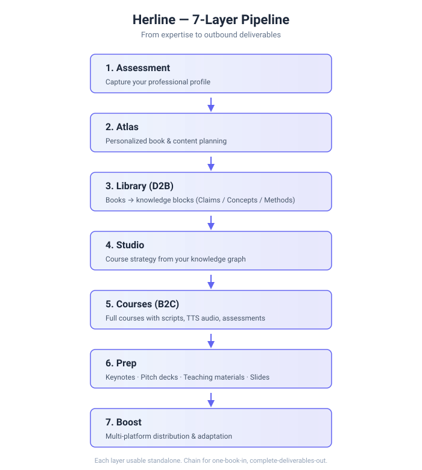

# Architecture

A deeper walkthrough of Herline's 7-layer pipeline than the main [README](../README.md) provides. Still conceptual — core engines are proprietary.

  

## Design Philosophy

Herline is built on three structural choices that differ from mainstream AI tools:

1. **Pipeline over prompt** — instead of a single prompt-and-response cycle, Herline runs specialized layers where each has one job and passes structured output to the next.
2. **Persistence over session** — knowledge extracted from any book or deep-read sticks in a personal graph, enabling cross-book RAG that compounds over time.
3. **Deliverables over documents** — the final output isn't a markdown file; it's a PDF with timing notes, a PPTX with speaker structure, or an audio course with assessments ready to deliver.

Each choice is deliberate. Generic AI tools optimize for breadth (answer anything); Herline optimizes for depth (a specific workflow done well).

## The 7 Layers in Depth

### 1. Assessment

**Role**: Onboarding layer that captures the user's professional profile.

**What it extracts**: expertise domains, learning goals, communication style preferences, target audience profile, professional use-case intent (public speaking / course creation / consulting / etc.).

**Why it matters**: all downstream personalization depends on the profile captured here. Poor Assessment data cascades into generic Atlas recommendations and off-target Studio strategies.

**Output**: structured profile stored in the user's knowledge graph, referenced by every subsequent layer.

### 2. Atlas

**Role**: Planning layer. Given the user's profile, proposes personalized reading and content paths.

**What it does**: recommends books, articles, and learning sequences aligned with the user's domain and goals. Maintains a dynamic map of "what this user has consumed" and "what's next high-value."

**Interaction model**: conversational — Atlas behaves as a knowledge planner the user can talk to, not a static recommendation list.

### 3. Library (D2B — "Deep-to-Book")

**Role**: The deconstruction engine. Takes a book (or long-form source material) and extracts a structured knowledge representation.

**What it produces**: three types of knowledge blocks:
- **Claims** — factual assertions with citation pointers
- **Concepts** — definable ideas, frameworks, or entities
- **Methods** — reproducible procedures or techniques

Each block includes: source location, confidence signal, related-block links, and metadata sufficient for cross-book retrieval.

**Why this schema**: it separates "what the author said" from "what the idea means" from "what you can do with it" — a separation that makes knowledge actually reusable across contexts.

### 4. Studio

**Role**: Course strategy layer. Takes a set of knowledge blocks (potentially drawn from multiple books via cross-book RAG) and designs a course blueprint.

**Inputs**:
- The user's target audience (level, goals, time budget)
- Selected knowledge blocks from the user's graph
- Desired format (audio course, video, text-only, hybrid)

**Output**: a structured course plan — units, learning arc, block-to-unit mapping, assessment design approach.

**Why it's a separate layer**: good courses aren't just ordered knowledge; they have a deliberate learning arc (setup → exploration → application → reflection). Studio codifies this as a first-class planning step, not a byproduct of generation.

### 5. Courses (B2C — "Book-to-Course")

**Role**: The generation engine. Takes a Studio blueprint and produces full course content.

**What it generates**:
- Unit scripts (typically 1200–1800 words each)
- TTS audio narration (multi-voice, bilingual)
- Assessment questions with difficulty distribution
- Transition copy, intro/outro framing

**Async execution**: B2C runs as a queued job (ARQ on Redis Streams) because generation + TTS synthesis can take 30–90 minutes for a full course. The frontend polls for progress.

**Quality controls**: block-to-script traceability (every generated paragraph maps back to source knowledge blocks), preventing hallucinated content.

### 6. Prep

**Role**: Delivery-format layer. Takes finished courses and transforms them into presentable deliverables. Operated by the **Hera** agent (see [Glossary](glossary.md)).

**Export formats** (production-stable since 2026 Q1):
- **PDF keynote** with timing annotations for stage delivery
- **PPTX** template with structured talking points per slide
- **DOCX** teaching materials for classroom use
- Quote / highlight cards for social distribution

**Why it matters**: course content ≠ deliverable content. Prep adds the affordances speakers and teachers actually need — the layer between "the course exists" and "you can walk on stage with it tomorrow."

### 7. Boost

**Role**: Multi-platform distribution layer. Takes content and adapts it for specific channels.

**Channels covered**: long-form social posts (Xiaohongshu, WeChat), short-form video scripts, podcast formats, newsletter adaptations.

**Design principle**: distribution is a lens, not a filter. The knowledge stays intact; only the framing and medium change per platform.

## State & Orchestration

Herline uses **LangGraph** as its orchestration framework. Each layer is modeled as a graph node (or subgraph) with:
- Typed state
- Explicit transitions
- Checkpointing for long-running jobs (D2B, B2C)
- Retryability at the node level

This lets us resume failed D2B extractions from the last checkpoint rather than restarting from scratch — important when a single extraction can run 10+ minutes.

## Knowledge Graph & Cross-Book RAG

The user's knowledge graph is the asset that makes long-term Herline users disproportionately productive.

**What accumulates**:
- Every extracted Claim, Concept, Method from every book
- Embeddings enabling semantic similarity across books
- Explicit links between related blocks (author citations, cross-references)
- User annotations, highlights, and course selections

**How it's queried**:
- **Within-book RAG** — "what does the author say about X?" (standard)
- **Cross-book RAG** — "what do my sources collectively say about X?" (the interesting one)

Cross-book RAG is where insights emerge that no single book contained. When building a course on, say, "behavioral economics in product design," a user who's deep-read Thinking, Fast and Slow and Predictably Irrational and Influence gets knowledge blocks from all three composed into a coherent course — without manually stitching.

## Async Processing

Long-running generation tasks run on ARQ (Python async queue) backed by Redis Streams:
- D2B full-book extraction
- B2C multi-unit course generation
- TTS audio synthesis
- Prep multi-format export

**Design goals**:
- Graceful cancellation (user clicks "stop" → worker exits cleanly)
- Idempotency on retry (failed jobs can be replayed without duplicating output)
- Observability (every job has a trace ID, propagated through all sub-calls)
- Cost metering (token usage tracked per job, attributed to user)

## Bilingual Architecture

Herline is bilingual (Chinese + English) first-class throughout:
- Deep-read supports source material in either language
- Knowledge blocks carry the original language; translations are generated on demand
- UI, TTS voices, and exported deliverables all bilingual
- Cross-book RAG works across language boundaries (an English book's concept can surface when building a Chinese course, if semantically relevant)

This is native support, not a translation layer bolted on top.

## Scaling Considerations

Herline runs a production stack sized for tens of thousands of users with heavy generation patterns. Key levers:
- **Async-by-default** — long jobs never block the UI
- **Shared vector index with per-user partitioning** — cross-book RAG is efficient without leaking user data
- **Cost-aware model routing** — cheaper models for extraction, reasoning models only where reasoning is required
- **Budget guards** — per-user and per-day spend limits prevent runaway jobs

## What's Not Described Here

The following are proprietary and deliberately omitted:
- Specific prompt engineering patterns per layer
- Specific model-routing logic
- Chunking and embedding strategies
- Retry policies and fallback chains
- Internal service topology and schema details

These are the parts of Herline that took the longest to tune, and they're what make the difference between a generic "AI pipeline" and one that reliably produces publication-grade deliverables.

---

**See also**: [Glossary](glossary.md) · [FAQ](faq.md) · [Data Handling](data-handling.md) · [Main README](../README.md)
